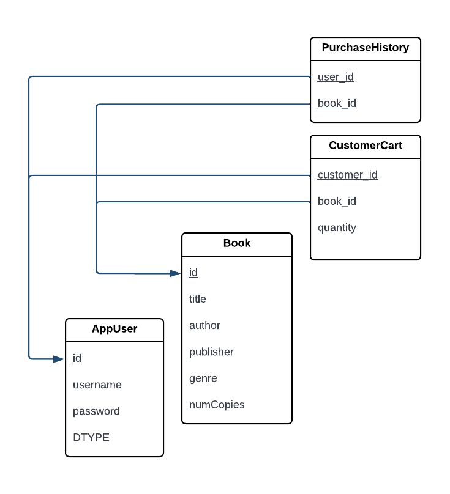
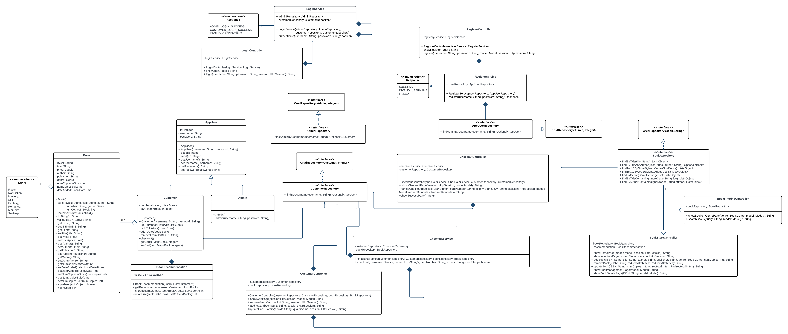

# SYSC4806-AmazonBookStore

**CI/CD**:

**GitHub repo**: https://github.com/its-jasmine/SYSC4806-AmazonBookStore

**Azure website domain**: https://bookstore-project.azurewebsites.net/

# Milestone 2 - Alpha Release

## Current State of the Project

### Functionality

<ins>Book Store Administrator can:</ins>

Add new book by inputting the following:
- ISBN
- Book Title
- Author
- Publisher
- Genre
- Stock Quantity
- Price

Remove book by inputting the following:
- ISBN

Update book stock by inputting the following:
- ISBN
- new stock value

<ins>Customer can:</ins>
- register for an account
- log in
- browse and search for books
- sort search results
- view book details & add to cart 
- view cart & proceed to checkout

### Endpoints 
**Catalog Page**: https://bookstore-project.azurewebsites.net/home

**Login Page**: https://bookstore-project.azurewebsites.net/login

**Register Page**: https://bookstore-project.azurewebsites.net/register

**Book Inventory**: https://bookstore-project.azurewebsites.net/inventory

**Search Results Page**: https://bookstore-project.azurewebsites.net/search-results?query=<query>

**Book Details Page**: https://bookstore-project.azurewebsites.net/book-details?ISBN=<ISBN>

**Shopping Cart**: https://bookstore-project.azurewebsites.net/cart

### Issue status (via Kanban) 
**Closed issues**
1. README Milestone 2
2. Updating functionality for book management
3. Book Browsing & Filtering
4. Book Recommendations
5. Book Recommendation Front-End
6. Book Recommendation Tests
7. Customer Book Purchase
8. Add navigations to all available pages in our web app
9. Front-end Enhancements
10. Login page for app users 
11. Database Transaction Testing 
12. Updating functionality for book management 
13. Searching and Sorting 
14. Investigate use of Logging (Kafka, DataDog, Splunk)

**Open issues** 
1. Data Dog Logging Implementation

   - **status**: In progress

2. Restricting access to inventory & book-management pages

   - **status**: Backlog

3. Adding a wishlist

   - **status**: Backlog

4. Creating more realistic sample data

   - **status**: Backlog

5. Add logout capabilities

   - **status**: Backlog

6. Book Improvements: Adding descriptions and book cover images

   - **status**: Backlog

## DB schema

Note on DTYPE attribute: The current implementation uses the default inheritance strategy InheritanceType.SINGLE_TABLE, 
which stores the sub-class entities in one table, with a DiscriminatorColumn with values to distinguish between the entity types.
By default this DiscriminatorColumn is named DTYPE. 

## UML Class Diagram

## Plan for Next Sprint - update
**Jasmine**
- Creating more realistic sample data

**Nivetha**
- Restricting access to inventory & book-management pages
- Book Improvements: Adding descriptions and book cover images

**Rimsha**
- Adding a wishlist
- 
**Victoria**
- Data Dog Logging Implementation
- Add logout capabilities

