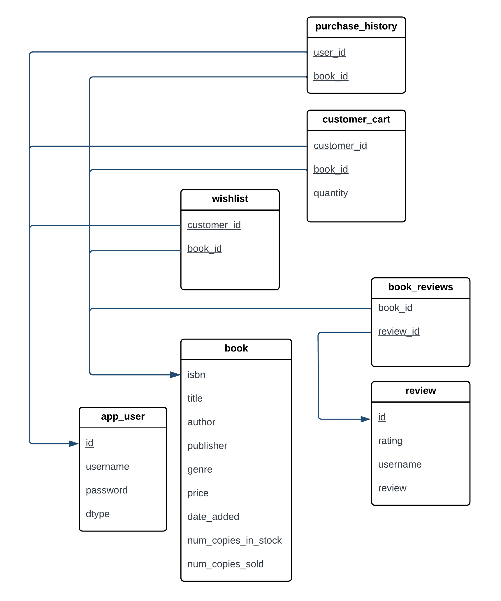

# SYSC4806-AmazonBookStore

**CI/CD**:

**GitHub repo**: https://github.com/its-jasmine/SYSC4806-AmazonBookStore

**Azure website domain**: https://bookstore-project.azurewebsites.net/

# Milestone 3 - Final demo

## Current State of the Project

### Functionality

<ins>Book Store Administrator can:</ins>

Add new book by inputting the following:
- ISBN
- Book Title
- Author
- Publisher
- Genre
- Stock Quantity
- Price

Remove book by inputting the following:
- ISBN

Update book stock by inputting the following:
- ISBN
- new stock value

<ins>Customer can:</ins>
- register for an account
- log in
- browse and search for books
- sort search results
- view book details & add to cart 
- view cart & proceed to checkout
- add reviews for books
- can rate books
- can add books to wishlist

### Endpoints 
**Catalog Page**: https://bookstore-project.azurewebsites.net/home

**Login Page**: https://bookstore-project.azurewebsites.net/login

**Register Page**: https://bookstore-project.azurewebsites.net/register

**Book Inventory**: https://bookstore-project.azurewebsites.net/inventory

**Search Results Page**: https://bookstore-project.azurewebsites.net/search-results?query=query-value

**Book Details Page**: https://bookstore-project.azurewebsites.net/book-details?ISBN=isbn-value

**Shopping Cart**: https://bookstore-project.azurewebsites.net/cart

**Checkout**: https://bookstore-project.azurewebsites.net/checkout

**Checkout Success**: https://bookstore-project.azurewebsites.net/checkout-success

### Issue status (via Kanban) 
**Closed issues**
1. README Milestone 2
2. Updating functionality for book management
3. Book Browsing & Filtering
4. Book Recommendations
5. Book Recommendation Front-End
6. Book Recommendation Tests
7. Customer Book Purchase
8. Add navigations to all available pages in our web app
9. Front-end Enhancements
10. Login page for app users 
11. Database Transaction Testing 
12. Updating functionality for book management 
13. Searching and Sorting 
14. Investigate use of Logging (Kafka, DataDog, Splunk)
15. Data Dog Logging Implementation
16. Front-End Enhancements
17. Book Recommendation Front-End
18. Add navigations to all available pages within our web app
19. Login page for app users
20. Database Transactions Testing
21. Updating functionality for book management
22. Searching and Sorting
23. Add book ratings
24. Create more realistic sample data
25. Restricting access to inventory & book-management pages
26. Make sure login/register are both visible when a user that is not logged in attempts to add to cart
27. Add Profile Page
28. Adding a wishlist
29. Creating more realistic sample data
30. Add logout capabilities
31. Book Improvements: Adding descriptions and book cover images
32. Add book ratings
33. UI Improvements for Milestone 3

**Open issues** 
8. UI Improvements for Milestone 3

   - **status**: Backlog

## DB schema

Note on DTYPE attribute: The current implementation uses the default inheritance strategy InheritanceType.SINGLE_TABLE, 
which stores the sub-class entities in one table, with a DiscriminatorColumn with values to distinguish between the entity types.
By default this DiscriminatorColumn is named DTYPE. 

## Class Diagram

