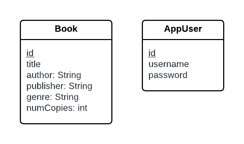

# SYSC4806-AmazonBookStore

**CI/CD**:

**GitHub repo**: https://github.com/its-jasmine/SYSC4806-AmazonBookStore

**Azure website domain**: https://bookstore-project.azurewebsites.net/

# Milestone 1 - One Operational Use Case

## Current State of the Project

### Functionality
**Implemented use case**: Book Management (add/remove)

Bookstore Owner can upload Book information (title, author, publisher, genre) and inventory.

**Book Management**: https://bookstore-project.azurewebsites.net/book-management

Book Owner can: 

Add new book by inputting the following:
- Book Title
- Author
- Publisher
- Genre
- Stock Quantity

Remove book by inputting the following:
- Book Title
- Author

The book inventory can be retrieved from the homepage:

The homepage provides book information along with how many copies are available.

**Inventory**: https://bookstore-project.azurewebsites.net/home

### Issue status (via Kanban)
**Closed issues**
1. Setting up CI/CD 
2. Maven Setup
3. PR Template
4. Creating Book class & CRUD Repository Interface
5. Controller & Endpoints for Book Operations
6. Front-End of Adding & Removing Books
7. Integrating Front-End & Back-End for Admin Use Case
8. UML class diagrams
9. Database schema diagrams
10. Unit Testing
11. Bug fix for duplicate books in DB
12. README

**Open issues**
1. Investigate use of Logging (Kafka, DataDog, Splunk): 

   - **status**: In progress

## DB schema

## UML Class Diagram

## Plan for Next Sprint
**Jasmine**
1. Book Browsing & Filtering use case

**Nivetha**
1. Book Recommendations use case

**Rimsha**
1. Customer Book Purchase use case 

**Victoria**
1. Investigate use of Logging (Kafka, DataDog, Splunk)
2. DataDog Logging Implementation
3. Front-End Enhancements (homepage)

