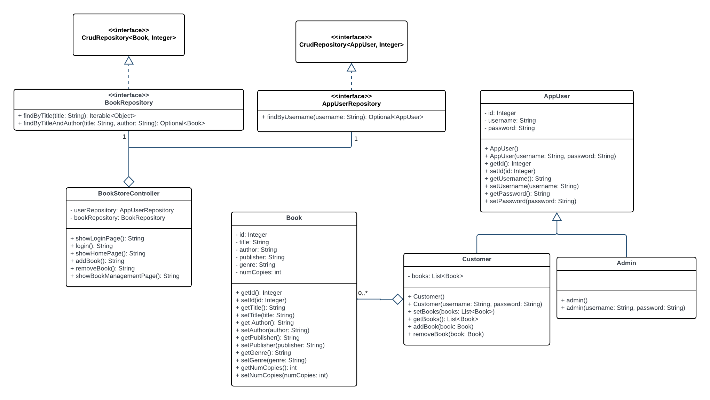

# SYSC4806-AmazonBookStore

**CI/CD**:

**GitHub repo**: https://github.com/its-jasmine/SYSC4806-AmazonBookStore

**Azure website domain**: https://bookstore-project.azurewebsites.net/

# Milestone 2 - Alpha Release

## Current State of the Project

### Functionality

Book Store Administrator can: 

Add new book by inputting the following:
- ISBN
- Book Title
- Author
- Publisher
- Genre
- Stock Quantity
- Price

Remove book by inputting the following:
- ISBN

Customer can:
- register for an account
- log in
- browse and search for books
- sort search results
- view book details & add to cart 
- view cart & proceed to checkout

  

### Endpoints - update
**Login Page**: https://bookstore-project.azurewebsites.net/login

**Register Page**: https://bookstore-project.azurewebsites.net/register

**Catalog Page**: https://bookstore-project.azurewebsites.net/home

**Book Inventory**: https://bookstore-project.azurewebsites.net/inventory

**Book Details Page**: https://bookstore-project.azurewebsites.net/book-details?ISBN=<ISBN>

**Shopping Cart**: https://bookstore-project.azurewebsites.net/cart

### Issue status (via Kanban) 
**Closed issues**
1. Login page for app users
2. Updating functionality for book management
3. Book Browsing & Filtering
4. Book Recommendations
5. Book Recommendation Front-End
6. Book Recommendation Tests
7. Customer Book Purchase
8. Adding navigation to all available pages in our web app
9. README Milestone 2

**Open issues** - update
1. Investigate use of Logging (Kafka, DataDog, Splunk): 

   - **status**: In progress

## DB schema

## UML Class Diagram -update

## Plan for Next Sprint - update
**Jasmine**

**Nivetha**

**Rimsha**

**Victoria**

