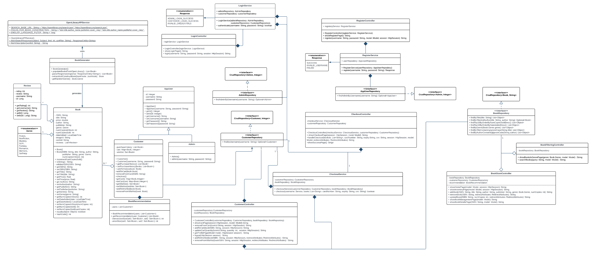

# SYSC4806-AmazonBookStore

**CI/CD**:

**GitHub repo**: https://github.com/its-jasmine/SYSC4806-AmazonBookStore

**Azure website domain**: https://bookstore-project.azurewebsites.net/

# Milestone 3 - Final demo

## Current State of the Project

### Functionality

<ins>Book Store Administrator can:</ins>

Add new book by inputting the following:
- ISBN
- Book Title
- Author
- Publisher
- Genre
- Stock Quantity
- Price

Remove book by inputting the following:
- ISBN

Update book stock by inputting the following:
- ISBN
- new stock value

<ins>Customer can:</ins>
- register for an account
- log in
- browse and search for books
- sort search results
- view book details & add to cart 
- view cart & proceed to checkout
- add reviews for books
- can rate books
- can add books to wishlist

### Endpoints 
**Catalog Page**: https://bookstore-project.azurewebsites.net/home

**Login Page**: https://bookstore-project.azurewebsites.net/login

**Register Page**: https://bookstore-project.azurewebsites.net/register

**Book Inventory**: https://bookstore-project.azurewebsites.net/inventory

**Search Results Page**: https://bookstore-project.azurewebsites.net/search-results?query=query-value

**Book Details Page**: https://bookstore-project.azurewebsites.net/book-details?ISBN=isbn-value

**Shopping Cart**: https://bookstore-project.azurewebsites.net/cart

**Checkout**: https://bookstore-project.azurewebsites.net/checkout

**Checkout Success**: https://bookstore-project.azurewebsites.net/checkout-success

### Issue status (via Kanban) 
**Closed issues**
1. Data Dog Logging Implementation
2. Book Improvements: Adding descriptions and book cover images
3. Add logout capabilities
4. Create more realistic sample data
5. Adding a wishlist
6. Restricting access to inventory & book-management pages
7. Add book ratings
8. UI Improvements for Milestone 3
9. Add Profile Page
10. Code base cleanup
11. Make sure login/register are both visible when a user that is not logged in attempts to add to cart
 

**Open issues** 
N/A

## DB schema

Note on DTYPE attribute: The current implementation uses the default inheritance strategy InheritanceType.SINGLE_TABLE, 
which stores the sub-class entities in one table, with a DiscriminatorColumn with values to distinguish between the entity types.
By default this DiscriminatorColumn is named DTYPE. 

## Class Diagram

